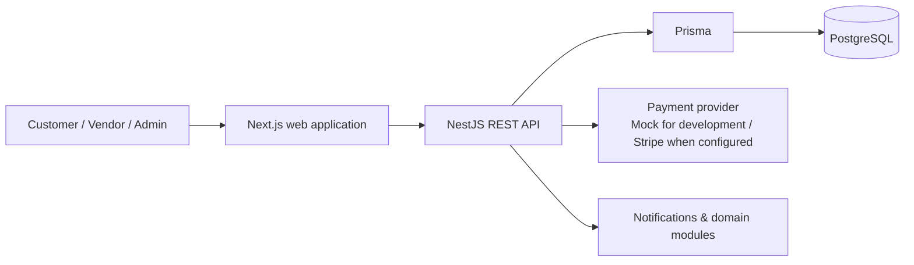

# ServiceHub

> A portfolio-ready **multi-vendor services marketplace**: customers discover and book local services, vendors manage availability and services, and administrators supervise marketplace operations.

**Documentation:** [العربية](README.ar.md) · [Português (Brasil)](README.pt-BR.md) · [Architecture](docs/ARCHITECTURE.md) · [Operations](docs/operations/local-and-deploy-runbook.md) · [Acceptance checklist](docs/qa/acceptance-checklist.md)

> **Project status — delivered portfolio MVP (16 July 2026).** The core marketplace flows are implemented and the API test suite currently passes **220/220 tests**. This is not presented as a public production deployment: external OAuth, live payment credentials, email delivery, production monitoring, and browser acceptance evidence are deliberately documented as separate work.

## Why ServiceHub?

Local service bookings are often fragmented across messages, calls, spreadsheets, and disconnected calendars. ServiceHub turns that into one auditable flow:

```text
Discover a provider → choose a service and slot → reserve safely → pay → receive updates → review
```

It supports restaurants, salons, consultants, repair providers, and similar appointment-based businesses.

## What is included

| Role | Verified product scope |
|---|---|
| **Customer** | Search and filters, provider profiles, availability slots, timed booking hold, checkout, cancellation policy, reviews, messages, and notification inbox |
| **Vendor** | Vendor onboarding status, service management, weekly availability/exceptions, booking visibility, and operational dashboard surfaces |
| **Admin** | Vendor approval/suspension, marketplace KPIs, reports, disputes, categories, financial-export and payout service layers |

### Engineering highlights

- **Database-enforced booking safety:** PostgreSQL `EXCLUDE USING gist` prevents overlapping active bookings for a vendor, even under concurrent requests.
- **Payment provider boundary:** development uses a signed Mock provider; the same domain interface supports Stripe for a properly configured production environment.
- **Defensive security baseline:** role guards, ownership/IDOR checks, bcrypt password hashing, refresh-token revocation, throttling, input validation, and CSRF guard coverage.
- **Explicit lifecycle rules:** 5-minute payment holds, cancellation conditions, idempotent payment-webhook transitions, and one review per eligible booking.
- **Clear separation:** Next.js web application, NestJS API modules, Prisma schema/migrations, PostgreSQL, and focused Jest suites.

## Architecture



| Layer | Technology | Responsibility |
|---|---|---|
| Web | Next.js 14, TypeScript, Tailwind | Customer, vendor, and admin journeys |
| API | NestJS 11, TypeScript | Auth, catalog, availability, bookings, payments, reviews, messaging, admin |
| Data | PostgreSQL 16, Prisma 5 | Transactional marketplace data and migrations |
| Tests | Jest + ts-jest | Service, security, integration, and acceptance-oriented checks |

## Repository layout

```text
apps/
  api/                    NestJS API
    prisma/               schema, migrations, seed utilities
    src/modules/          domain modules
    test/                 integration and acceptance-oriented tests
  web/                    Next.js application
docs/                     architecture, QA, operations, presentations
scripts/                  repeatable project utilities
```

## Local setup

### Prerequisites

- Node.js 24.x (the repository is verified with the project Node environment)
- PostgreSQL 16+
- A local database and environment file derived from `apps/api/.env.example`

### API

```bash
cd apps/api
cp .env.example .env             # set local values; never commit this file
npm install
npx prisma migrate deploy
npx prisma generate
npm run build
npm start
```

The API listens on the prefix `http://localhost:3001/api/v1` when using the repository defaults.

### Web

```bash
cd apps/web
npm install
npm run build
npm start
```

For development, use `npm run start:dev` inside `apps/api` and `npm run dev` inside `apps/web`.

## Payments and demo boundaries

`PAYMENTS_PROVIDER=mock` is for development and portfolio demonstrations. The local mock confirmation endpoint exercises the payment state machine without real card data or external provider credentials.

- **Mock mode is not a real payment integration.**
- A real Stripe path requires valid secrets, verified raw-body webhook handling, deployment configuration, and end-to-end provider testing.
- The **Google (Demo)** entry point is a local simulation only; it does not contact Google and must not be described as OAuth.

## Verification

The latest independent local verification on **16 July 2026**:

```text
cd apps/api
npx jest --runInBand

15 test suites passed
220 tests passed
0 snapshots
```

For the full evidence model and browser QA still to be run, see [`docs/qa/acceptance-checklist.md`](docs/qa/acceptance-checklist.md). A green unit/integration run is not a substitute for production deployment or browser acceptance testing.

## Presentation material

- [English editable deck](docs/ServiceHub-Presentation-EN.pptx)
- [Arabic editable deck](docs/ServiceHub-Presentation-AR.pptx)
- [Portuguese (Brazil) editable deck](docs/ServiceHub-Apresentacao-PT-BR.pptx)
- [Deck generator](docs/generate_servicehub_multilingual_presentations.py)
- Product and delivery evidence: [`docs/PRD-COMPLIANCE-REPORT-2026-07-14.md`](docs/PRD-COMPLIANCE-REPORT-2026-07-14.md)

## License

Proprietary © 2026. This repository is shared as a portfolio and learning artifact; reuse or redistribution requires permission.
